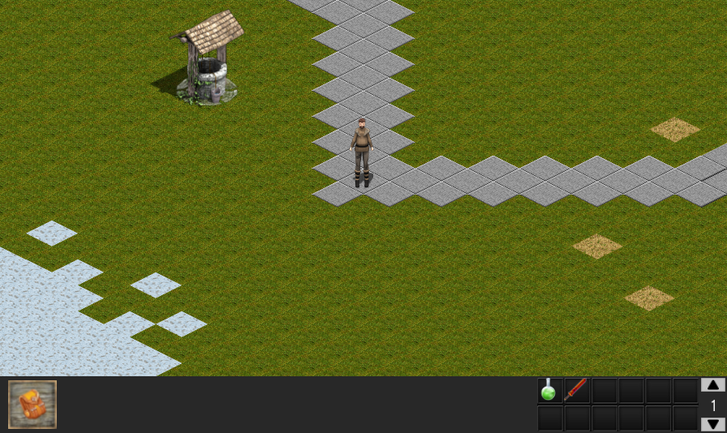

  
  
Teal is a C++14 RPG, scriptable in Lua.   
It uses a nightly of [Nazara Engine](https://github.com/DigitalPulseSoftware/NazaraEngine) ([nightly link](https://github.com/S6066/NazaraEngine/releases/tag/v0.4.y)), and an altered version of [micropather](https://github.com/leethomason/MicroPather) ([altered source link](https://github.com/S6066/Teal/tree/master/extlibs/src/micropather))

# Build
Platform       | Status          | Nightlies
-------------- | --------------- | ------------------
[Windows (MSVC)](https://ci.appveyor.com/project/S6066/teal) |  | Release [x64](https://ci.appveyor.com/api/projects/S6066/Teal/artifacts/build%2Fresult%2FTeal.7z?branch=master&job=Environment:+APPVEYOR_BUILD_WORKER_IMAGE=Visual+Studio+2017,+TOOLSET=vs2017,+CONFIG=Release,+PLATFORM=x64)/[x86](https://ci.appveyor.com/api/projects/S6066/Teal/artifacts/build%2Fresult%2FTeal.7z?branch=master&job=Environment:+APPVEYOR_BUILD_WORKER_IMAGE=Visual+Studio+2017,+TOOLSET=vs2017,+CONFIG=Release,+PLATFORM=x86) & Debug [x64](https://ci.appveyor.com/api/projects/S6066/Teal/artifacts/build%2Fresult%2FTeal.7z?branch=master&job=Environment:+APPVEYOR_BUILD_WORKER_IMAGE=Visual+Studio+2017,+TOOLSET=vs2017,+CONFIG=Debug,+PLATFORM=x64)/[x86](https://ci.appveyor.com/api/projects/S6066/Teal/artifacts/build%2Fresult%2FTeal.7z?branch=master&job=Environment:+APPVEYOR_BUILD_WORKER_IMAGE=Visual+Studio+2017,+TOOLSET=vs2017,+CONFIG=Debug,+PLATFORM=x86)
[Linux (GCC)](https://ci.appveyor.com/project/S6066/teal) |  | [Release x64](https://ci.appveyor.com/api/projects/S6066/Teal/artifacts/build%2Fresult%2FTeal.7z?branch=master&job=Environment:+APPVEYOR_BUILD_WORKER_IMAGE=Ubuntu1804,+TOOLSET=gmake,+CONFIG=release,+PLATFORM=x64), [Debug x64](https://ci.appveyor.com/api/projects/S6066/Teal/artifacts/build%2Fresult%2FTeal.7z?branch=master&job=Environment:+APPVEYOR_BUILD_WORKER_IMAGE=Ubuntu1804,+TOOLSET=gmake,+CONFIG=debug,+PLATFORM=x64)

# How to script?
You can script maps using the [Tiled Map Editor](http://mapeditor.org) and [Tiled2Teal](https://github.com/S6066/tiled2teal)  
Items, animations, characters, and skills can also be customized with scripts, but there's no tutorial (yet!)  
You can look into `/wdirs/data/script/` files though, and try to make your own