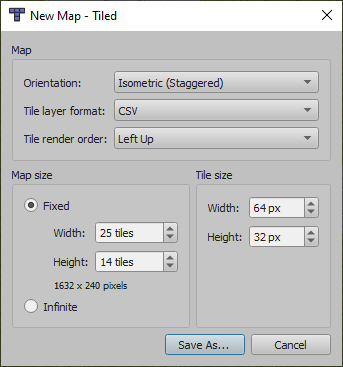
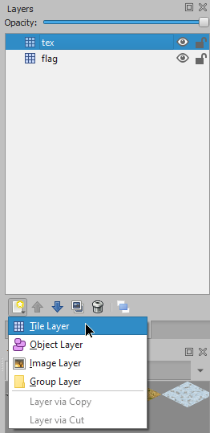

#  →   
Converts Tiled maps to Teal map format. (CLI)

## Tutorial
### 1) Create a Tiled map
* Download and install Tiled from [the official site](http://mapeditor.org), its user manual is available [here](http://doc.mapeditor.org/en/stable/)
* Open Tiled, create a new map (`File > New > New map`, or press `Ctrl+N`)  

* At the left, in the properties window (also openable from `Map > Map Properties`), change the `Stagger Axis` to X  

* This is what you should have now  

* At the right, in the Tilesets window (also openable from `View > Views and Toolbars > Tilesets`), add a new tileset  

* Images path:  
`/Teal/wdirs/data/util/tileset.png`  
`/Teal/wdirs/data/util/tileset_fight.png`  
`/Teal/wdirs/data/util/tileset_invisibility.png`  
`/Teal/wdirs/data/util/tileset_obs.png`  
`/Teal/wdirs/data/util/tileset_spawn.png`  
* Click browse, select tileset image, check `Embed in map`, and press `OK`  

* Repeat previous step with every images mentionned before.  

* After having added every tilesets, let's add the correct layers. **Layers's names must NOT change !**
* First of all, remove the default tile layer `Tile Layer 1`  

* Then, add these layers:  
`tex` - Default map tileset, just used for textures  
`ftex` - Map tileset used in fights, just used for textures  
`obs` - Tileset used to determine if a tile is an obstacle or not  
`spawn` - Tileset used to determine if someone can spawn onto that tile in fights  
`inv` - Tileset used to determine if a tile is invisible or not  

* Now, you can use Tiled to make your map ! But beware, layers are associated to tilesets:  

Layer Name | Tileset
---------- | -------
`tex`      | `tileset`
`ftex`     | `tileset_fight`
`obs`      | `tileset_obs`
`spawn`    | `tileset_spawn`
`inv`      | `tileset_invisibility`

So, before putting a tile on a layer, make sure the correct layer & tileset are selected (else, since only numbers are exported with the .csv format, wrong tiles will be exported)

### 2) Export the tiled map
* `File > Export As...`, select `CSV Files` in the File's Type list
* (Optional) Copy the 5 `.csv` files in Tiled2Teal's executable directory
* Start Tiled2Teal, and follow the instructions.  

### 3) Try that map with Teal
Just copy the outputted `.lua` file into `/Teal/wdirs/data/script/maps`. It will be automatically parsed.
